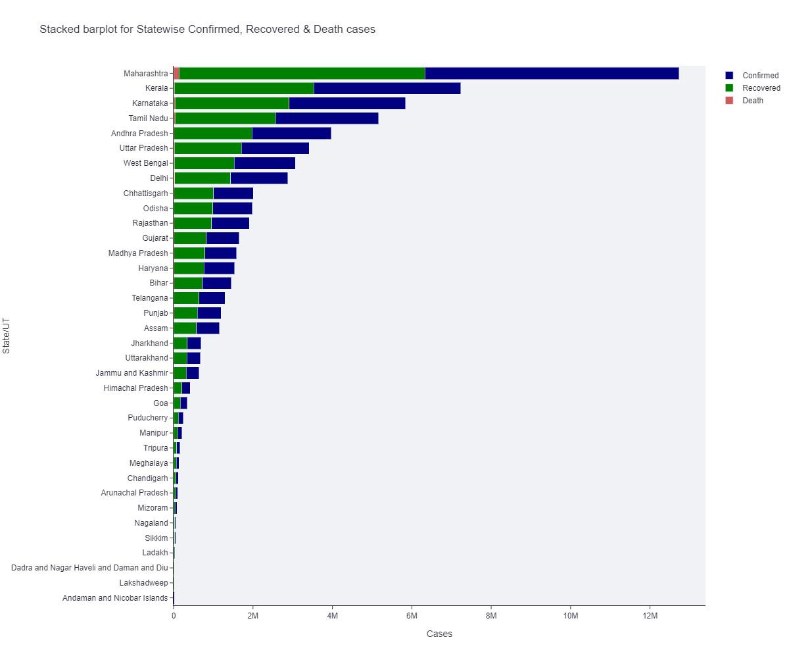
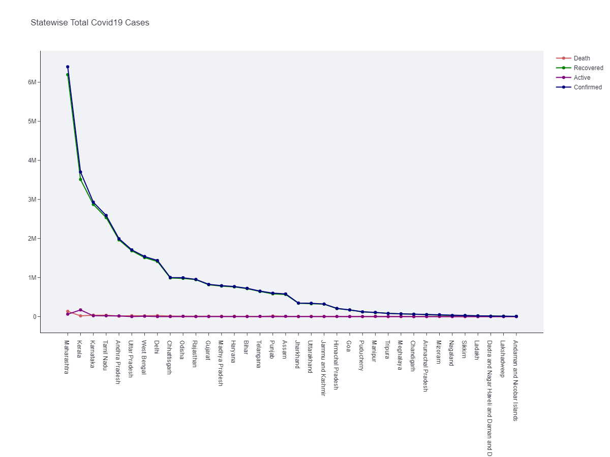
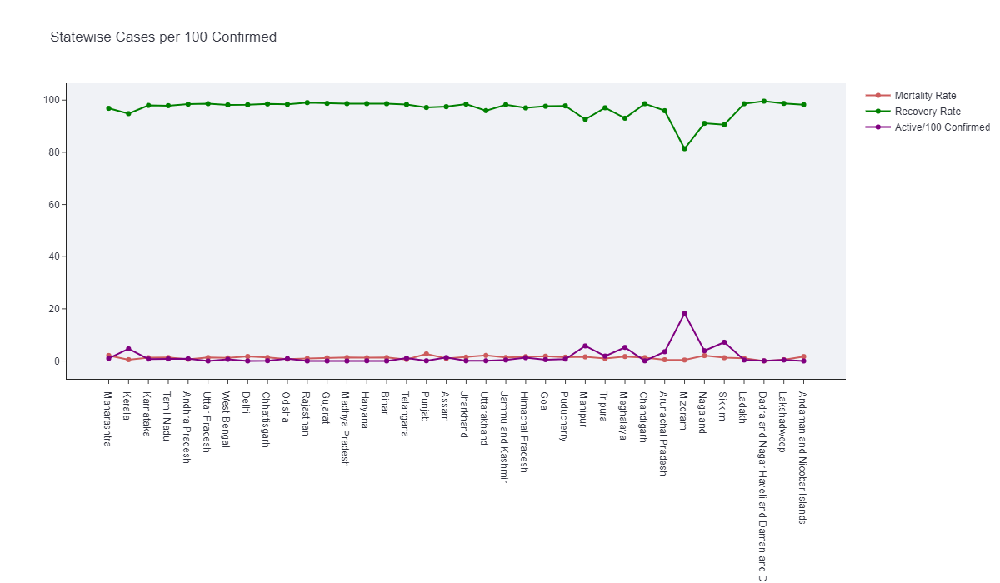
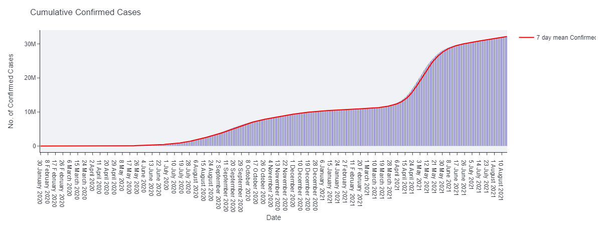
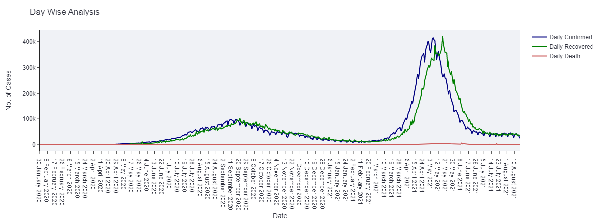
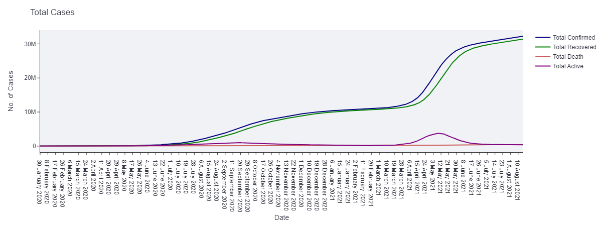
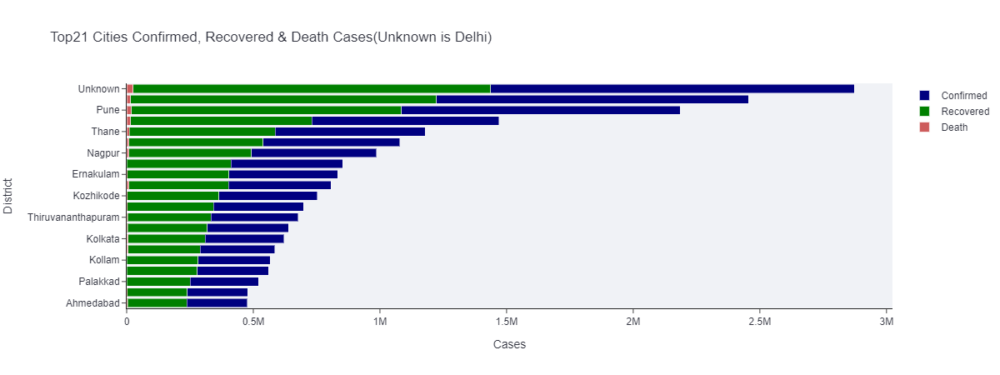

# Covid19 Data Visualization
This project is an attempt to visualize the distribution of Covid19 cases chronologically in different states. A [Python web application](https://share.streamlit.io/yesdeepakmittal/covid19-pandemic-in-india) is also made using Streamlit framework. 

## How to use it?
- Install latest version of [Python](https://www.python.org/downloads/)
- Make a [Virtual Environment](https://gist.github.com/yesdeepakmittal/61494217c8be4a7e61524e27824943bd) and activate it.
- Clone this repository `git clone https://github.com/yesdeepakmittal/COVID19-Pandemic-in-India.git`
- `cd COVID19-Pandemic-in-India`
- `pip install -r requirements.txt`
- run application using `streamlit run app.py`
- Check your application in the browser at `http://localhost:8501` 

## Overview

## Support
- Please contribute to the project by adding new functionality and opening a pull request
- For any support to configure this project, consider opening an [Issue](https://github.com/yesdeepakmittal/COVID19-Pandemic-in-India/issues/new)
